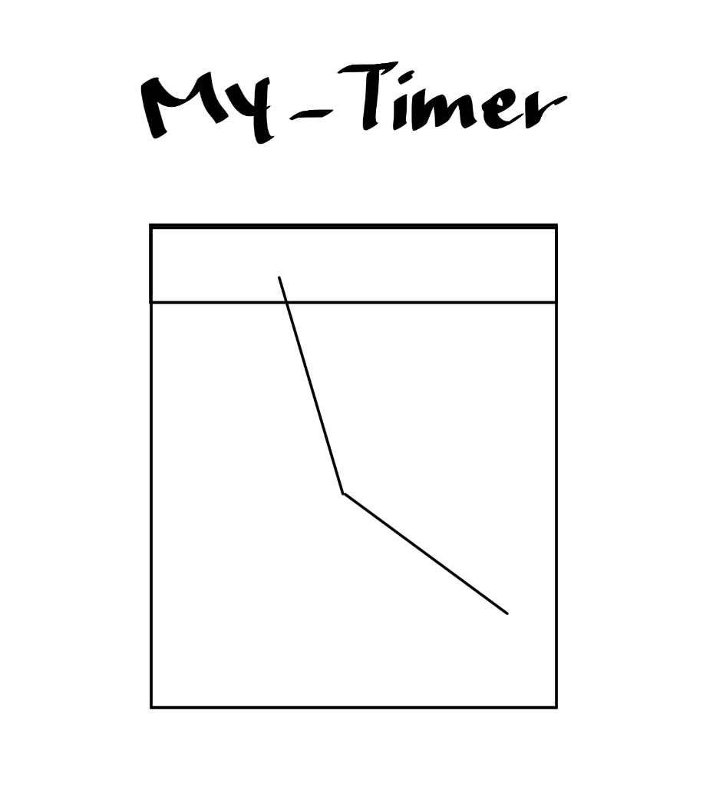
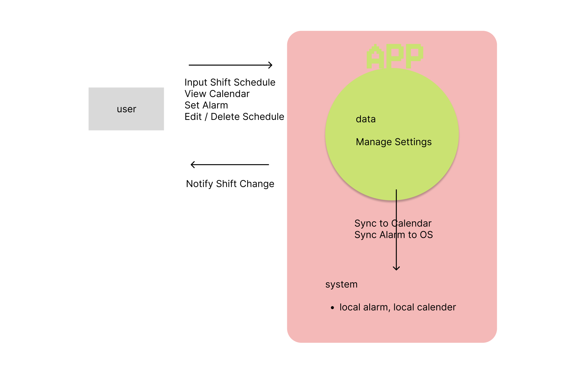

# 1. Conceptualization

> 3교대 근무자를 위한 알람·캘린더 연동 앱 🗓️

| | |
|---|---|
| **Student No.** | 22311880 |
| **Name** | 이아연 |
| **E-mail** | ayeon56@yu.ac.kr |

---

## [ Revision history ]

| Revision date | Version # | Description | Author |
|---|---|---|---|
| 2026.03.21 | 1.0.0 | First Draft | |
| | | | |
| | | | |

---

## = Contents =

| # | 섹션 | 페이지 |
|---|---|---|
| 1 | Business purpose | 1 |
| 2 | System context diagram | 2 |
| 3 | Use case list | 3 |
| 4 | Concept of operation | 5 |
| 5 | Problem statement | 9 |
| 6 | Glossary | 10 |
| 7 | References | 10 |

---

# 1. Business purpose

### 1) Project background

현대의 특정 산업들은 365일, 24시간동안 돌아가야 하는 형태다. 교대 근무자(간호사, 공장 근로자, 소방관, 물류 종사자 등)는 매주 변경되는 근무 스케줄로 인해 알람 설정과 개인 일정 관리에 큰 어려움을 겪는다. 일반적인 알람 앱은 고정 패턴에 최적화되어 있어 매주 다른 시간대에 출근해야 하는 교대 근무자에게는 매번 수동으로 알람을 재설정해야 하는 번거로움이 있다. 또한 스케줄표를 출력물의 형태로 배포받는 경우는 캘린더에 본인의 근무 스케줄을 등록하면서 매주마다 자신의 알람이 잘 맞춰져 있는지도 확인하는 작업이 필요하다.

위에서 언급한 문제들을 해결하기 위해, 근무 스케줄에 따라 유동적으로 관리가 되는 알람 시스템이 있으면 어떨까 생각하였고, 근무 스케줄 관리 앱 **My_timer**를 개발하게 되었다.

구현하고자 하는 핵심 기능들은 아래와 같다.

- 근무 유형(주간/야간/비번/휴무)을 날짜별로 등록하면 해당 유형에 맞는 알람이 자동으로 설정된다.
- 등록된 근무 스케줄은 기기의 캘린더 앱과 자동으로 동기화되어 별도 관리를 할 필요가 없다.
- 반복 패턴(예: 주야비휴 4일 순환)을 설정하면 다음 주 스케줄이 자동 생성된다.
- 스케줄 수정 시 연동된 알람과 캘린더 이벤트가 즉시 갱신된다.

### 2) Target Market

- 교대 근무를 하는 모든 직종의 근무자: 간호사, 공장 교대 근무자, 경비원, 소방관, 물류 센터 근무자 등
- 매주 스케줄이 바뀌어 알람을 반복적으로 재설정해야 하는 불편함을 겪는 사용자

---

# 2. System context diagram

| 기능 (English) | 설명 (한국어) |
|---|---|
| Input Shift Schedule | 근무 스케줄 입력 |
| View Calendar | 캘린더 조회 |
| Set Alarm | 알람 설정 |
| Sync to Calendar | 기기 캘린더 동기화 |
| Sync Alarm to OS | OS 알람 동기화 |
| Edit / Delete Schedule | 스케줄 수정/삭제 |
| Notify Shift Change | 근무 변경 알림 |
| Manage Settings | 앱 설정 관리 |

---

# 3. Use case list

| Use Case | *1) Input Shift Schedule* |
|---|---|
| **Actor** | User |
| **Description** | 사용자가 주간 근무 유형(주간/야간/비번/휴무 등)을 직접 입력하거나 패턴을 선택하여 스케줄을 등록한다. |

| Use Case | *2) View Calendar* |
|---|---|
| **Actor** | User |
| **Description** | 사용자는 월별/주별 캘린더 뷰에서 등록된 근무 스케줄을 확인한다. 기기의 캘린더(Google Calendar 또는 기기 캘린더)와 동기화하여 조회할 수 있다. |

| Use Case | *3) Set Alarm* |
|---|---|
| **Actor** | User |
| **Description** | 사용자는 근무 시작 전 알람을 자동 또는 수동으로 설정한다. 근무 유형별로 다른 알람 시간 및 알림 메시지를 지정할 수 있다. |

| Use Case | *4) Sync to Calendar* |
|---|---|
| **Actor** | User, OS Calendar |
| **Description** | 등록된 근무 스케줄을 기기 캘린더(기기 내장 캘린더)에 자동으로 이벤트로 등록한다. 스케줄 수정 시 캘린더도 자동 갱신된다. |

| Use Case | *5) Sync Alarm to OS* |
|---|---|
| **Actor** | User |
| **Description** | 근무 일정에 맞춰 OS의 AlarmManager를 통해 알람을 자동으로 등록하거나 취소한다. |

| Use Case | *6) Edit / Delete Schedule* |
|---|---|
| **Actor** | User |
| **Description** | 기존에 입력된 근무 스케줄을 수정하거나 삭제할 수 있다. 변경 시 연동된 알람과 캘린더 이벤트도 함께 갱신된다. |

| Use Case | *7) Notify Shift Change* |
|---|---|
| **Actor** | User |
| **Description** | 스케줄 변경이나 알람 시간 도달 시 푸시 알림으로 사용자에게 안내한다. |

| Use Case | *8) Manage Settings* |
|---|---|
| **Actor** | User |
| **Description** | 알람 소리, 진동, 기본 알람 시간, 근무 유형 색상 등 앱 설정을 관리한다. |

---

# 4. Concept of operation

### 1) Input Shift Schedule

| 항목 | 내용 |
|---|---|
| **Purpose** | 근무자가 매주 변경되는 근무 유형을 앱에 등록 |
| **Approach** | 메인 화면에서 날짜를 선택하고, 주간(Day)/야간(Night)/비번(Off-duty)/휴무(Holiday) 중 하나를 선택하여 저장한다. 반복 패턴(예: 주야비휴 순환)을 설정하면 자동으로 다음 주 일정이 채워진다. 데이터는 기기 내 SQLite DB(sqflite 패키지)에 저장된다. |
| **Dynamics** | 사용자가 새로운 주의 스케줄을 등록하거나 기존 패턴을 수정하려 할 때 |
| **Goals** | 정확한 근무 스케줄을 앱에 반영하여 이후 알람·캘린더 동기화의 기반 데이터로 활용한다. |

### 2) View Calendar

| 항목 | 내용 |
|---|---|
| **Purpose** | 등록된 근무 스케줄을 달력 형태로 시각적으로 확인 |
| **Approach** | table_calendar 패키지를 사용해 월간 뷰를 제공하고, 근무 유형별 색상으로 구분 표시한다(예: 주간=파랑, 야간=보라, 휴무=초록). 기기 캘린더와 연동된 이벤트도 함께 표시한다. |
| **Dynamics** | 사용자가 이번 달 또는 다음 달 근무 일정을 한눈에 파악하려 할 때 |
| **Goals** | 사용자가 캘린더 뷰에서 근무 패턴을 직관적으로 파악하고, 개인 일정과 비교할 수 있도록 한다. |

### 3) Set Alarm

| 항목 | 내용 |
|---|---|
| **Purpose** | 근무 시작 시간에 맞는 알람을 자동/수동으로 등록 |
| **Approach** | 스케줄 등록 시 근무 유형별 기본 알람 시간(예: 주간근무 → 07:00, 야간근무 → 22:30)을 자동 설정한다. 사용자가 개별 날짜별로 알람 시간을 수동 조정할 수도 있다. AlarmSetting 클래스에 알람 시간, 메시지, 반복 여부를 저장한다. |
| **Dynamics** | 스케줄이 새로 등록되거나 수정될 때, 또는 사용자가 직접 알람 설정을 변경할 때 |
| **Goals** | 근무 유형에 맞는 알람이 자동으로 설정되어 사용자가 매주 수동으로 알람을 설정하는 불편함을 없앤다. |

### 4) Sync to Calendar

| 항목 | 내용 |
|---|---|
| **Purpose** | 근무 스케줄을 기기 캘린더 이벤트로 자동 등록 |
| **Approach** | device_calendar 패키지를 사용해 기기 캘린더에 접근 권한을 요청한 후, 각 근무 일정을 캘린더 이벤트(CalendarEvent)로 생성한다. 제목은 근무 유형명(예: '[주간] 근무')으로 설정하고, 시작/종료 시간을 포함한다. 스케줄 수정·삭제 시 기존 이벤트를 갱신·삭제한다. |
| **Dynamics** | 스케줄이 등록·수정·삭제될 때 SyncService가 자동으로 캘린더 동기화를 수행 |
| **Goals** | 기기 캘린더에서도 근무 일정을 확인할 수 있어 다른 개인 일정과 통합 관리가 가능하다. |

### 5) Sync Alarm to OS

| 항목 | 내용 |
|---|---|
| **Purpose** | 근무 일정에 맞춰 OS 알람을 자동 등록·취소 |
| **Approach** | flutter_local_notifications 패키지를 사용해 AlarmManager를 통한 정확한 시간의 알람을 OS에 등록한다. Android 12 이상에서 필요한 SCHEDULE_EXACT_ALARM 권한을 명시적으로 요청한다. 스케줄 변경 시 기존 알람을 취소하고 새 알람을 등록한다. |
| **Dynamics** | SyncService가 스케줄 등록·수정·삭제 이벤트를 감지했을 때 |
| **Goals** | 앱을 실행하지 않아도 OS 수준에서 알람이 울리도록 보장한다. |

### 6) Edit / Delete Schedule

| 항목 | 내용 |
|---|---|
| **Purpose** | 기존 근무 스케줄 수정 및 삭제 |
| **Approach** | 캘린더 화면에서 특정 날짜를 탭하면 수정 다이얼로그가 나타난다. 근무 유형 변경 또는 삭제를 선택할 수 있으며, 확인 즉시 DB 업데이트 → 알람 갱신 → 캘린더 이벤트 갱신이 순서대로 처리된다. |
| **Dynamics** | 사용자가 등록된 스케줄을 변경하거나 삭제하려 할 때 |
| **Goals** | 스케줄 변경이 알람과 캘린더에 즉시 반영되어 일관성을 유지한다. |

### 7) Notify Shift Change

| 항목 | 내용 |
|---|---|
| **Purpose** | 알람 시간 도달 또는 스케줄 변경 시 사용자에게 알림 |
| **Approach** | flutter_local_notifications 패키지의 푸시 알림 기능을 사용한다. 알람 시간 도달 시 '주간 근무 시작 1시간 전입니다' 등의 메시지를 표시하고, 진동 및 소리를 함께 출력한다. |
| **Dynamics** | 알람 등록 시간이 되었을 때, 또는 스케줄 일괄 변경이 완료되었을 때 |
| **Goals** | 사용자가 앱을 실행하지 않아도 적시에 알림을 받아 근무를 놓치지 않도록 한다. |

### 8) Manage Settings

| 항목 | 내용 |
|---|---|
| **Purpose** | 앱 전반의 사용자 설정 관리 |
| **Approach** | SharedPreferences(shared_preferences 패키지)에 설정값을 저장한다. 설정 항목: 근무 유형별 기본 알람 시간, 미리 울리는 알람 시간(15분/30분/60분 전), 알람 소리/진동 여부, 근무 유형별 캘린더 색상. |
| **Dynamics** | 사용자가 앱의 기본 동작을 자신의 근무 패턴에 맞게 커스터마이즈하려 할 때 |
| **Goals** | 다양한 교대 패턴(주야비휴, 2교대 등)에 유연하게 대응할 수 있도록 설정의 자유도를 높인다. |

---

# 5. Problem statement

**Overview**

> 'My_timer'는 교대 근무자가 매주 바뀌는 스케줄을 앱에 한 번만 입력하면, 알람과 기기 캘린더가 자동으로 연동되어 관리 부담을 최소화하는 것이 목적이다. 이 시스템은 다음과 같은 목적을 달성해야 한다.

- 정확한 알람 시간 관리 (OS 알람과의 정확한 동기화)
- 기기 캘린더와의 실시간 이벤트 연동
- 스케줄 변경 시 알람과 캘린더의 즉각적 갱신
- 외부 서버 없이 기기 내 로컬 데이터만으로 안정적인 동작

| 문제 | 내용 |
|---|---|
| **Problem #1** 알람 정확성 | Android 12 이상에서는 `SCHEDULE_EXACT_ALARM` 권한이 필요하며, 배터리 최적화 설정에 따라 알람이 지연되거나 취소될 수 있다. 권한 요청 처리와 배터리 최적화 예외 등록 로직이 반드시 필요하다. |
| **Problem #2** 캘린더 권한 | 기기 캘린더 접근을 위해 `READ_CALENDAR` 및 `WRITE_CALENDAR` 권한이 필요하다. 권한 거부 시에도 앱 내부 캘린더 뷰는 정상 동작하는 처리가 필요하다. |
| **Problem #3** 데이터 정합성 | 스케줄 수정 시 DB, OS 알람, 캘린더 이벤트 세 곳의 데이터가 일관되게 갱신되어야 한다. 동기화 실패 시 롤백 처리가 필요하다 |
| **Problem #4** 플랫폼 제한 | 본 프로젝트는 Android(Flutter) 기반으로 개발되므로 iOS에서는 동작하지 않는다. 새로 구현이 필요하다. |

---

# 6. Glossary

| 용어 (Terms) | 설명 (Description) |
|---|---|
| **근무 유형 (ShiftType)** | 주간(Day), 야간(Night), 비번(Off-duty), 휴무(Holiday) 등 교대 근무의 각 교대 구분 |
| **근무 스케줄 (ShiftSchedule)** | 특정 날짜에 할당된 근무 유형 및 시간 정보의 집합 |
| **알람 설정 (AlarmSetting)** | 특정 근무 일정에 연결된 알람 시간, 메시지, 반복 여부 등의 설정 데이터 |
| **캘린더 이벤트 (CalendarEvent)** | 기기 캘린더에 등록되는 근무 일정 이벤트 데이터 모델 |
| **동기화 (Sync)** | 앱 내 근무 스케줄을 기기 OS의 알람 및 캘린더에 반영하는 과정 |
| **AlarmManager** | Android OS에서 특정 시간에 알람을 실행시키는 OS 수준의 API |
| **CalendarProvider** | Android OS에서 기기 캘린더 데이터를 읽고 쓰는 ContentProvider API |
| **SyncService** | 스케줄 변경을 감지하고 알람·캘린더 동기화를 조율하는 내부 서비스 클래스 |
| **SQLite (sqflite)** | 앱 내 근무 스케줄 데이터를 로컬에 영구 저장하는 경량 데이터베이스 |
| **SharedPreferences** | 알람 선행 시간, 근무 색상 등 앱 설정값을 key-value 형태로 저장하는 로컬 저장소 |

---

# 7. References

| # | 참조 |
|---|---|
| 1 | Flutter 공식 문서: https://docs.flutter.dev |
| 2 | flutter_local_notifications 패키지: https://pub.dev/packages/flutter_local_notifications |
| 3 | Android Developer - AlarmManager: https://developer.android.com/reference/android/app/AlarmManager |
| 4 | Android Developer - CalendarProvider: https://developer.android.com/guide/topics/providers/calendar-provider |
