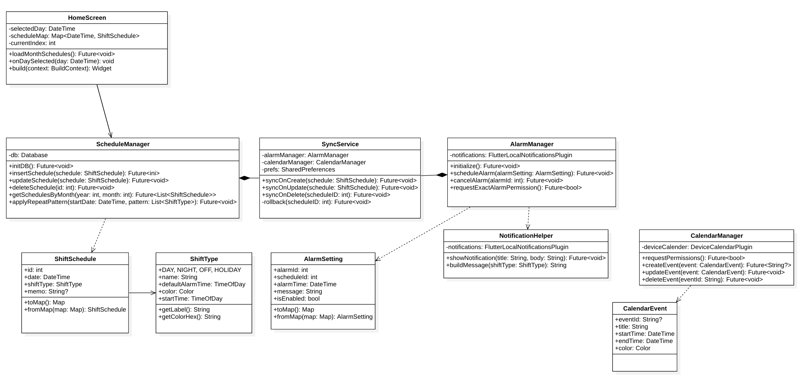
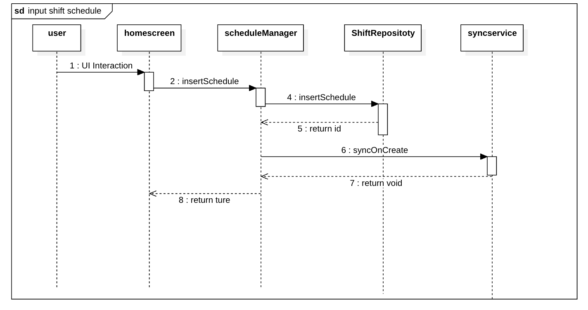
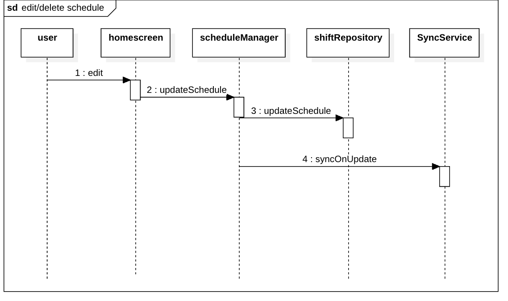
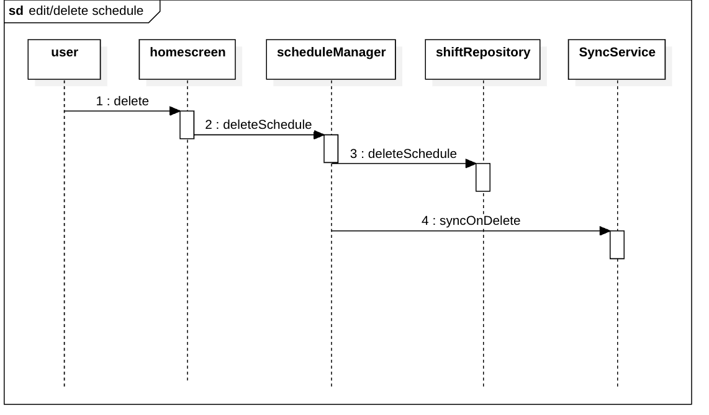
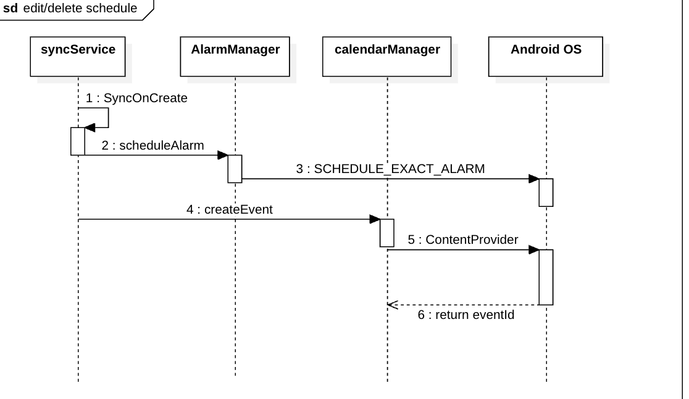
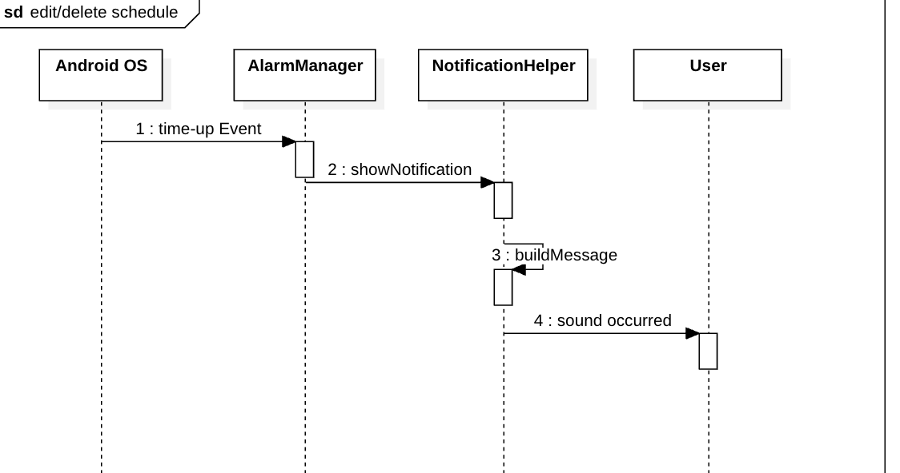
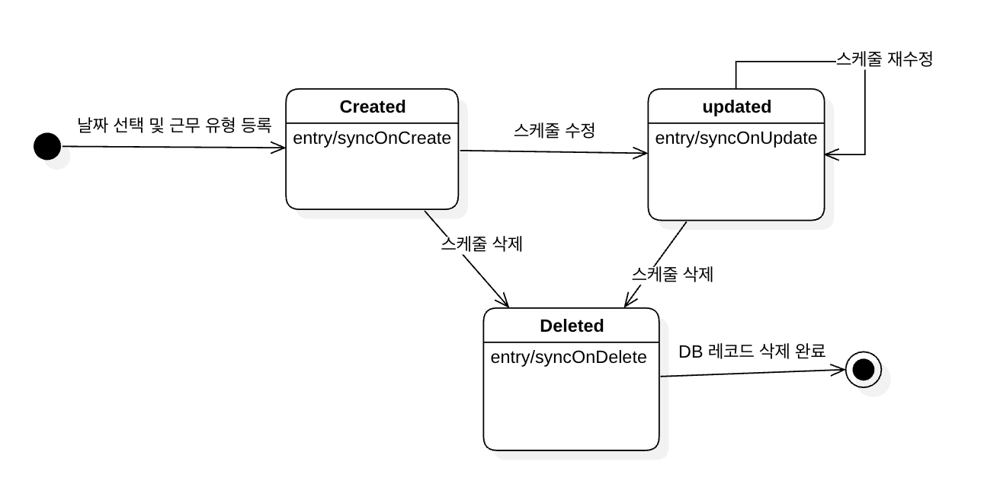
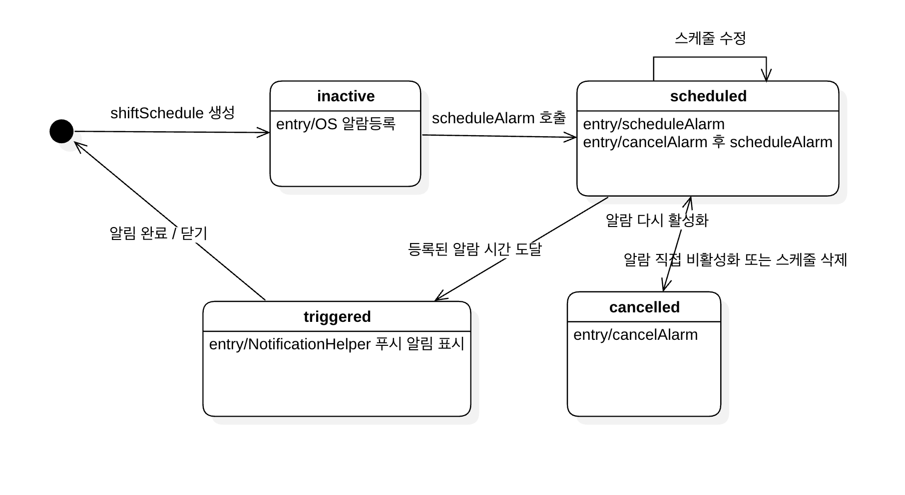

# My_timer
## 3. Design Document

| | |
|---|---|
| **Student No.** | 22311880 |
| **Name** | 이아연 |
| **E-mail** | ayeon56@yu.ac.kr |

---

## [ Revision history ]

| Revision date | Version # | Description | Author |
|---|---|---|---|
| 2026/05/19 | 0.01 | First Documentation | 이아연 |
| | | | |

---

## = Contents =

1. Introduction
2. Class diagram
3. Sequence diagram
4. State machine diagram
5. Implementation requirements
6. Glossary
7. References

---

## 1. Introduction

본 문서는 Analysis Document에 이은 세 번째 단계인 Design 단계의 문서다. Analysis 단계에서 정의한 도메인 클래스와 Use Case를 바탕으로, 실제 구현에 필요한 클래스의 속성과 메서드를 구체화하고 시스템의 흐름을 설계하는 것이 이 단계의 목적이다.

My_timer는 교대 근무자가 근무 유형(주간·야간·비번·휴무)을 날짜별로 등록하면, 해당 유형에 맞는 알람이 자동으로 설정되고 기기 캘린더와도 자동으로 동기화되는 Android(Flutter) 기반 앱이다. 외부 서버 없이 기기 내 로컬 데이터만으로 동작하며, 스케줄이 변경될 때마다 알람과 캘린더 이벤트가 즉시 갱신되는 것이 핵심이다.

이 문서에서는 Class Diagram을 통해 각 클래스의 속성과 메서드를 정의하고, Sequence Diagram을 통해 주요 기능의 객체 간 상호작용 흐름을 기술한다. 또한 State Machine Diagram을 통해 주요 객체의 상태 변화를 표현한다. 마지막으로 구현에 필요한 개발 환경과 패키지 목록을 기술한다.

---

## 2. Class diagram

---

### 1) ShiftType

| «enumeration» ShiftType |
|---|
| DAY, NIGHT, OFF, HOLIDAY |
| +name: String |
| +defaultAlarmTime: TimeOfDay |
| +color: Color |
| +startTime: TimeOfDay |
| +endTime: TimeOfDay |
| +getLabel(): String |
| +getColorHex(): String |

| Attributes | |
|---|---|
| name: String | 근무 유형의 이름 (예: '주간', '야간') |
| defaultAlarmTime: TimeOfDay | 해당 유형의 기본 알람 시간 |
| color: Color | 캘린더에 표시될 색상 |
| startTime: TimeOfDay | 근무 시작 시간 |
| endTime: TimeOfDay | 근무 종료 시간 |

| Methods | |
|---|---|
| getLabel(): String | 화면에 표시할 근무 유형 이름을 반환 |
| getColorHex(): String | 캘린더 표시용 색상의 HEX 코드를 반환 |

| Description | |
|---|---|
| ShiftType은 열거형(Enum) 클래스로, Model의 역할을 한다. 주간(DAY), 야간(NIGHT), 비번(OFF), 휴무(HOLIDAY) 네 가지 근무 유형을 정의하며, 각 유형별로 기본 알람 시간과 캘린더 색상 정보를 가진다. | |

---

### 2) ShiftSchedule

| «dataType» ShiftSchedule |
|---|
| +id: int |
| +date: DateTime |
| +shiftType: ShiftType |
| +memo: String? |
| +toMap(): Map\<String, dynamic\> |
| +fromMap(map): ShiftSchedule |

| Attributes | |
|---|---|
| id: int | SQLite DB 저장용 고유 식별자 |
| date: DateTime | 해당 근무의 날짜 |
| shiftType: ShiftType | 해당 날짜에 배정된 근무 유형 |
| memo: String? | 선택적으로 입력 가능한 메모 (nullable) |

| Methods | |
|---|---|
| toMap(): Map\<String, dynamic\> | SQLite 저장을 위해 객체를 Map 형태로 변환 |
| fromMap(map): ShiftSchedule | DB에서 읽어온 Map을 ShiftSchedule 객체로 변환 (factory) |

| Description | |
|---|---|
| ShiftSchedule은 Model의 역할을 하는 클래스이다. 특정 날짜에 할당된 근무 유형과 시간 정보를 저장하며, SQLite DB에 저장되는 기본 단위이다. | |

---

### 3) ScheduleManager

| ScheduleManager |
|---|
| -_db: Database |
| +initDB(): Future\<void\> |
| +insertSchedule(schedule): Future\<int\> |
| +updateSchedule(schedule): Future\<void\> |
| +deleteSchedule(id): Future\<void\> |
| +getSchedulesByMonth(year, month): Future\<List\<ShiftSchedule\>\> |
| +applyRepeatPattern(startDate, pattern): Future\<void\> |

| Attributes | |
|---|---|
| _db: Database | sqflite 패키지의 DB 인스턴스 |

| Methods | |
|---|---|
| initDB(): Future\<void\> | DB를 초기화하고 테이블을 생성 |
| insertSchedule(schedule): Future\<int\> | 새로운 근무 스케줄을 DB에 등록하고 생성된 id를 반환 |
| updateSchedule(schedule): Future\<void\> | 기존 스케줄 정보를 DB에서 수정 |
| deleteSchedule(id): Future\<void\> | 해당 id의 스케줄을 DB에서 삭제 |
| getSchedulesByMonth(year, month): Future\<List\<ShiftSchedule\>\> | 해당 연월의 스케줄 목록을 DB에서 조회하여 반환 |
| applyRepeatPattern(startDate, pattern): Future\<void\> | 반복 패턴(예: 주야비휴)을 기반으로 이후 날짜의 스케줄을 자동 생성하여 DB에 저장 |

| Description | |
|---|---|
| ScheduleManager는 Controller의 역할을 한다. 근무 스케줄의 등록·수정·삭제(CRUD)를 담당하며, sqflite 패키지를 통해 SQLite DB와 직접 통신한다. 데이터 변경이 발생할 때마다 SyncService를 호출하여 알람과 캘린더 동기화를 트리거한다. | |

---

### 4) AlarmSetting

| «dataType» AlarmSetting |
|---|
| +alarmId: int |
| +scheduleId: int |
| +alarmTime: DateTime |
| +message: String |
| +isEnabled: bool |
| +toMap(): Map\<String, dynamic\> |
| +fromMap(map): AlarmSetting |

| Attributes | |
|---|---|
| alarmId: int | OS 알람 등록에 사용되는 고유 식별자 |
| scheduleId: int | 연결된 ShiftSchedule의 id |
| alarmTime: DateTime | 알람이 울릴 정확한 시각 |
| message: String | 알림 메시지 내용 (예: '주간 근무 1시간 전입니다') |
| isEnabled: bool | 알람 활성화 여부 |

| Methods | |
|---|---|
| toMap(): Map\<String, dynamic\> | DB 저장을 위해 객체를 Map 형태로 변환 |
| fromMap(map): AlarmSetting | DB에서 읽어온 Map을 AlarmSetting 객체로 변환 (factory) |

| Description | |
|---|---|
| AlarmSetting은 Model의 역할을 하는 클래스이다. 특정 근무 일정에 연결된 알람의 시간, 메시지, 활성화 여부 등의 설정 데이터를 저장한다. SQLite DB의 alarm_settings 테이블에 저장되며, AlarmManager가 OS 알람을 등록할 때 이 객체의 정보를 사용한다. | |

---

### 5) AlarmManager

| AlarmManager |
|---|
| -_notifications: FlutterLocalNotificationsPlugin |
| +initialize(): Future\<void\> |
| +scheduleAlarm(alarmSetting): Future\<void\> |
| +cancelAlarm(alarmId): Future\<void\> |
| +requestExactAlarmPermission(): Future\<bool\> |

| Attributes | |
|---|---|
| _notifications: FlutterLocalNotificationsPlugin | flutter_local_notifications 패키지의 플러그인 인스턴스 |

| Methods | |
|---|---|
| initialize(): Future\<void\> | 앱 시작 시 알람 플러그인을 초기화 |
| scheduleAlarm(alarmSetting): Future\<void\> | AlarmSetting 정보를 바탕으로 OS에 알람을 등록 |
| cancelAlarm(alarmId): Future\<void\> | 해당 alarmId에 해당하는 OS 알람을 취소 |
| requestExactAlarmPermission(): Future\<bool\> | Android 12 이상에서 필요한 SCHEDULE_EXACT_ALARM 권한을 요청하고 결과를 반환 |

| Description | |
|---|---|
| AlarmManager는 Controller의 역할을 한다. flutter_local_notifications 패키지를 사용하여 Android OS의 AlarmManager API와 연동하며, 근무 일정에 맞는 알람을 등록하거나 취소한다. Android 12 이상에서 요구되는 권한 처리 로직을 포함한다. | |

---

### 6) CalendarEvent

| «dataType» CalendarEvent |
|---|
| +eventId: String? |
| +title: String |
| +startTime: DateTime |
| +endTime: DateTime |
| +color: Color |

| Attributes | |
|---|---|
| eventId: String? | 기기 캘린더에서 발급된 이벤트 고유 ID (nullable, 등록 전에는 null) |
| title: String | 이벤트 제목 (예: '[주간] 근무') |
| startTime: DateTime | 이벤트 시작 시간 |
| endTime: DateTime | 이벤트 종료 시간 |
| color: Color | 기기 캘린더에 표시될 색상 |

| Description | |
|---|---|
| CalendarEvent는 Model의 역할을 하는 클래스이다. 기기 캘린더에 등록되는 근무 일정 이벤트의 데이터 모델로, CalendarManager가 device_calendar 패키지를 통해 기기 캘린더에 이벤트를 등록할 때 이 객체의 정보를 사용한다. | |

---

### 7) CalendarManager

| CalendarManager |
|---|
| -_deviceCalendar: DeviceCalendarPlugin |
| +requestPermissions(): Future\<bool\> |
| +createEvent(event): Future\<String?\> |
| +updateEvent(event): Future\<void\> |
| +deleteEvent(eventId): Future\<void\> |

| Attributes | |
|---|---|
| _deviceCalendar: DeviceCalendarPlugin | device_calendar 패키지의 플러그인 인스턴스 |

| Methods | |
|---|---|
| requestPermissions(): Future\<bool\> | READ_CALENDAR, WRITE_CALENDAR 권한을 요청하고 결과를 반환 |
| createEvent(event): Future\<String?\> | CalendarEvent 정보를 기기 캘린더에 이벤트로 등록하고 생성된 eventId를 반환 |
| updateEvent(event): Future\<void\> | 기기 캘린더에 등록된 이벤트를 수정 |
| deleteEvent(eventId): Future\<void\> | 해당 eventId에 해당하는 기기 캘린더 이벤트를 삭제 |

| Description | |
|---|---|
| CalendarManager는 Controller의 역할을 한다. device_calendar 패키지를 사용하여 Android 기기의 CalendarProvider API와 연동하며, 근무 일정을 기기 캘린더 이벤트로 생성·수정·삭제한다. 권한이 거부된 경우에는 기기 캘린더 동기화를 건너뛰고 앱 내부 캘린더만 갱신한다. | |

---

### 8) SyncService

| SyncService |
|---|
| -_alarmManager: AlarmManager |
| -_calendarManager: CalendarManager |
| -_prefs: SharedPreferences |
| +syncOnCreate(schedule): Future\<void\> |
| +syncOnUpdate(schedule): Future\<void\> |
| +syncOnDelete(scheduleId): Future\<void\> |
| -_rollback(scheduleId): Future\<void\> |

| Attributes | |
|---|---|
| _alarmManager: AlarmManager | 알람 처리를 위한 AlarmManager 인스턴스 |
| _calendarManager: CalendarManager | 캘린더 처리를 위한 CalendarManager 인스턴스 |
| _prefs: SharedPreferences | 알람 선행 시간 등 설정값 접근용 |

| Methods | |
|---|---|
| syncOnCreate(schedule): Future\<void\> | 스케줄 등록 시 AlarmManager와 CalendarManager를 순서대로 호출하여 동기화 수행 |
| syncOnUpdate(schedule): Future\<void\> | 스케줄 수정 시 기존 알람·이벤트를 취소하고 새 알람·이벤트를 등록 |
| syncOnDelete(scheduleId): Future\<void\> | 스케줄 삭제 시 연결된 알람과 캘린더 이벤트를 제거 |
| _rollback(scheduleId): Future\<void\> | 동기화 도중 오류 발생 시 이전 상태로 되돌리는 롤백 처리 |

| Description | |
|---|---|
| SyncService는 Controller의 역할을 한다. ScheduleManager로부터 스케줄 변경 이벤트를 전달받아 AlarmManager와 CalendarManager를 조율하는 클래스이다. DB·OS 알람·캘린더 이벤트 세 곳의 데이터가 항상 일관되게 유지되도록 하며, 동기화 실패 시 롤백 처리를 담당한다. | |

---

### 9) NotificationHelper

| NotificationHelper |
|---|
| -_notifications: FlutterLocalNotificationsPlugin |
| +showNotification(title, body): Future\<void\> |
| +buildMessage(shiftType): String |
| +requestNotificationPermission(): Future\<bool\> |

| Attributes | |
|---|---|
| _notifications: FlutterLocalNotificationsPlugin | 알림 표시를 위한 플러그인 인스턴스 |

| Methods | |
|---|---|
| showNotification(title, body): Future\<void\> | 제목과 내용을 받아 즉시 푸시 알림을 표시 |
| buildMessage(shiftType): String | 근무 유형에 맞는 알림 메시지 문자열을 생성하여 반환 |
| requestNotificationPermission(): Future\<bool\> | Android 13 이상에서 필요한 알림 권한을 요청하고 결과를 반환 |

| Description | |
|---|---|
| NotificationHelper는 Controller의 역할을 한다. 알람 시간이 되었을 때 사용자에게 표시할 푸시 알림 메시지를 생성하고 전달하는 클래스이다. 근무 유형에 맞는 메시지 포맷과 진동·소리 설정을 관리하며, 앱이 실행되지 않은 상태에서도 알림이 정상 표시되도록 처리한다. | |

---

### 10) HomeScreen (MainActivity)

| HomeScreen |
|---|
| -_selectedDay: DateTime |
| -_scheduleMap: Map\<DateTime, ShiftSchedule\> |
| -_currentIndex: int |
| +_loadMonthSchedules(): Future\<void\> |
| +_onDaySelected(day): void |
| +build(context): Widget |

| Attributes | |
|---|---|
| _selectedDay: DateTime | 현재 사용자가 선택한 날짜 |
| _scheduleMap: Map\<DateTime, ShiftSchedule\> | 캘린더에 표시하기 위한 날짜-스케줄 매핑 |
| _currentIndex: int | 현재 선택된 하단 네비게이션 탭의 인덱스 |

| Methods | |
|---|---|
| _loadMonthSchedules(): Future\<void\> | DB에서 해당 월의 스케줄을 조회하여 _scheduleMap을 갱신하고 화면을 다시 그림 |
| _onDaySelected(day): void | 날짜를 탭했을 때 스케줄 등록 또는 수정/삭제 다이얼로그를 표시 |
| build(context): Widget | 월간 캘린더, 하단 네비게이션 바 등 전체 UI를 렌더링 |

| Description | |
|---|---|
| HomeScreen은 앱의 진입점이자 전체 UI를 구성하는 클래스이다. table_calendar 패키지를 사용하여 월간 캘린더를 렌더링하며, 근무 유형별 색상을 적용하여 날짜별 근무 패턴을 직관적으로 보여준다. 하단 네비게이션 바에서 캘린더, 알람 목록, 설정 탭으로 이동할 수 있다. | |

---

## 3. Sequence diagram

### 1) Input Shift Schedule

Input Shift Schedule Use Case에서의 Sequence Diagram이다. HomeScreen과 ScheduleManager가 핵심 기능을 수행하는 클래스이며, SyncService가 알람·캘린더 동기화를 조율한다.

사용자가 캘린더 화면에서 날짜를 탭하면 시작된다. HomeScreen은 해당 날짜에 등록된 스케줄이 없는 경우 근무 유형 선택 다이얼로그를 표시한다. 사용자가 근무 유형(주간/야간/비번/휴무)을 선택하고 확인 버튼을 누르면, ScheduleManager의 insertSchedule 메서드를 통해 SQLite DB에 저장된다. 저장이 완료되면 SyncService의 syncOnCreate가 호출되며, 이 안에서 AlarmManager의 scheduleAlarm을 통해 OS 알람이 등록되고, CalendarManager의 createEvent를 통해 기기 캘린더에 이벤트가 생성된다. 모든 처리가 완료되면 HomeScreen에 저장 완료 메시지가 표시되고 캘린더 화면이 갱신되며 끝난다.

이때, 사용자가 반복 패턴 설정을 선택하면 ScheduleManager의 applyRepeatPattern 메서드를 통해 이후 날짜들이 자동으로 채워진다. 또한 캘린더 접근 권한이 없는 경우에는 권한 요청 다이얼로그를 표시하고, 권한이 거부되면 기기 캘린더 동기화는 건너뛰고 앱 내부 캘린더만 갱신한다.

---

### 2) Edit / Delete Schedule

Edit / Delete Schedule Use Case에서의 Sequence Diagram이다. HomeScreen과 ScheduleManager, SyncService가 핵심 기능을 수행하는 클래스이다.

사용자가 이미 스케줄이 등록된 날짜를 탭하면 시작된다. HomeScreen은 수정 또는 삭제를 선택하는 다이얼로그를 표시한다. 사용자가 수정을 선택한 경우, 근무 유형 변경 다이얼로그를 다시 표시하고 사용자가 새로운 유형을 선택하면 ScheduleManager의 updateSchedule 메서드를 통해 DB를 갱신한다. 이후 SyncService의 syncOnUpdate가 호출되어 AlarmManager의 cancelAlarm으로 기존 알람을 취소하고, scheduleAlarm으로 새 알람을 등록한다. CalendarManager의 updateEvent를 통해 기기 캘린더 이벤트도 함께 갱신된다.

사용자가 삭제를 선택한 경우에는 삭제 확인 메시지를 먼저 표시한다. 사용자가 확인하면 ScheduleManager의 deleteSchedule 메서드를 통해 DB에서 해당 스케줄을 삭제하고, SyncService의 syncOnDelete가 호출되어 연결된 알람 취소와 캘린더 이벤트 삭제가 순서대로 처리된다. 모든 처리가 완료되면 HomeScreen의 캘린더 화면이 갱신되며 끝난다.

---

### 3) Sync Alarm to OS

Sync Alarm to OS Use Case에서의 Sequence Diagram이다. SyncService의 호출을 시작으로 AlarmManager가 핵심 기능을 수행하는 클래스이다.

SyncService가 syncOnCreate 또는 syncOnUpdate를 실행하면서 AlarmManager의 scheduleAlarm이 호출될 때 시작된다. AlarmManager는 먼저 requestExactAlarmPermission 메서드를 통해 Android 12 이상에서 필요한 SCHEDULE_EXACT_ALARM 권한이 있는지 확인한다. 권한이 없는 경우 권한 요청 다이얼로그를 사용자에게 표시하며, 권한이 거부되면 정확도가 낮은 근사치 알람(inexact alarm)으로 등록한다. 권한이 허용된 경우에는 FlutterLocalNotificationsPlugin의 zonedSchedule 메서드를 통해 알람 시각과 메시지를 담아 Android OS의 AlarmManager API에 정확한 시간의 알람을 등록한다. 등록이 완료되면 SyncService에 완료를 알리며 끝난다.

---

### 4) Notify Shift Change

Notify Shift Change Use Case에서의 Sequence Diagram이다. NotificationHelper가 핵심 기능을 수행하는 클래스이며, 앱이 실행되지 않은 상태에서도 동작한다.

OS AlarmManager에 등록된 알람 시간이 되면 시작된다. Android OS가 FlutterLocalNotificationsPlugin을 트리거하면, NotificationHelper의 buildMessage 메서드가 근무 유형에 맞는 알림 메시지를 생성한다(예: '주간 근무 시작 1시간 전입니다'). 이후 showNotification 메서드가 호출되어 생성된 메시지를 사용자 기기 화면에 푸시 알림으로 표시하며, 진동과 소리도 함께 출력된다. 알림이 성공적으로 전달되면 끝난다. 단, 기기의 알림 권한이 꺼져있는 경우에는 알림이 표시되지 않으며, 앱 내에서 알림 권한 설정 안내를 제공한다.

---

## 4. State machine diagram

### 1) ShiftSchedule 상태 머신

ShiftSchedule이 My_timer 서비스에서 겪게 되는 상태 변화를 나타낸다.

사용자가 캘린더에서 날짜를 선택하고 근무 유형을 등록하면 ShiftSchedule 객체가 생성되어 Created 상태로 진입한다. 이 상태에서 DB 저장과 알람·캘린더 동기화(syncOnCreate)가 수행된다.

Created 상태에서 사용자가 해당 날짜의 스케줄을 수정하면 Updated 상태로 전이된다. 이때 DB 갱신과 함께 기존 알람이 취소되고 새 알람이 등록되며 캘린더 이벤트도 갱신된다(syncOnUpdate). Updated 상태에서 다시 수정이 발생하면 Updated 상태를 유지한다.

Created 또는 Updated 상태에서 사용자가 스케줄을 삭제하면 Deleted 상태로 전이된다. Deleted 상태에서는 DB에서 해당 레코드가 삭제되고, 연결된 OS 알람이 취소되며 기기 캘린더 이벤트도 제거된다(syncOnDelete). Deleted 상태는 최종 상태로, 이후 동일 날짜에 새 스케줄을 등록하면 새로운 ShiftSchedule 객체가 Created 상태로 시작된다.

---

### 2) AlarmSetting 상태 머신

AlarmSetting이 My_timer 서비스에서 겪게 되는 상태 변화를 나타낸다.

ShiftSchedule이 생성되면 연결된 AlarmSetting 객체가 함께 생성되며 Inactive(비활성) 상태로 시작된다. 이후 AlarmManager의 scheduleAlarm이 호출되어 OS에 알람이 정상 등록되면 Scheduled(등록됨) 상태로 전이된다.

Scheduled 상태에서 스케줄이 수정되면 기존 알람이 cancelAlarm으로 취소되고 새 알람이 scheduleAlarm으로 재등록되어 Scheduled 상태를 유지한다. 사용자가 알람을 직접 비활성화하거나 스케줄이 삭제되면 cancelAlarm이 호출되어 Cancelled(취소됨) 상태로 전이된다.

Scheduled 상태에서 등록된 알람 시간에 도달하면 Triggered(울림) 상태로 전이되며, OS가 NotificationHelper를 통해 사용자에게 푸시 알림을 표시한다. 알림이 완료되면 자동으로 Inactive 상태로 돌아온다. Cancelled 상태에서 다시 알람을 활성화하면 scheduleAlarm이 호출되어 Scheduled 상태로 전이된다.

---

## 5. Implementation requirements

### S/W Requirements

| 항목 | 내용 |
|---|---|
| **언어** | Dart 3.x |
| **프레임워크** | Flutter 3.x |
| **IDE** | Android Studio Hedgehog 이상 또는 VS Code |
| **최소 Android 버전** | Android 8.0 (API Level 26) |
| **권장 Android 버전** | Android 12 이상 (API Level 31+) |
| **로컬 DB** | SQLite (sqflite 패키지) |
| **설정 저장** | SharedPreferences |

### 주요 패키지 목록

| 패키지 | 용도 |
|---|---|
| flutter_local_notifications | OS 알람 등록 및 푸시 알림 표시 |
| device_calendar | 기기 캘린더 이벤트 읽기·쓰기 |
| sqflite | 로컬 SQLite DB 관리 |
| shared_preferences | 앱 설정값 key-value 저장 |
| table_calendar | 월간 캘린더 UI 렌더링 |
| permission_handler | 런타임 권한 요청 처리 |
| provider | 상태 관리 |

### H/W Requirements

- Android 기반의 스마트 기기
- Android 8.0(Oreo) 이상 탑재 기기

---

## 6. Glossary

| 용어 (Term) | 설명 (Description) |
|---|---|
| **근무 유형 (ShiftType)** | 주간(DAY), 야간(NIGHT), 비번(OFF), 휴무(HOLIDAY) 등 교대 근무의 각 구분을 나타내는 열거형 |
| **근무 스케줄 (ShiftSchedule)** | 특정 날짜에 할당된 근무 유형 및 시간 정보의 집합. SQLite DB에 저장되는 기본 단위 |
| **알람 설정 (AlarmSetting)** | 특정 근무 일정에 연결된 알람 시간, 메시지, 활성화 여부 등의 설정 데이터 |
| **캘린더 이벤트 (CalendarEvent)** | 기기 캘린더에 등록되는 근무 일정 이벤트의 데이터 모델 |
| **동기화 (Sync)** | 앱 내 근무 스케줄을 기기 OS의 알람 및 캘린더에 반영하는 과정 |
| **SyncService** | 스케줄 변경을 감지하고 AlarmManager와 CalendarManager를 조율하여 데이터 일관성을 유지하는 클래스 |
| **AlarmManager (앱)** | flutter_local_notifications 패키지를 통해 OS 알람을 등록하거나 취소하는 앱 내부 클래스 |
| **Android AlarmManager** | Android OS에서 특정 시간에 알람을 실행시키는 OS 수준의 API |
| **CalendarProvider** | Android OS에서 기기 캘린더 데이터를 읽고 쓰는 ContentProvider API |
| **sqflite** | Flutter에서 SQLite를 사용하기 위한 패키지. 앱 내 근무 스케줄 데이터를 로컬에 영구 저장 |
| **SharedPreferences** | 알람 선행 시간, 근무 색상 등 앱 설정값을 key-value 형태로 저장하는 로컬 저장소 |
| **SCHEDULE_EXACT_ALARM** | Android 12(API 31) 이상에서 정확한 시간에 알람을 등록하기 위해 필요한 권한 |
| **Rollback** | 동기화 과정에서 일부 작업이 실패했을 때 이전 상태로 되돌리는 처리 |
| **Enum (열거형)** | 정해진 상수 값들의 집합을 하나의 타입으로 정의하는 방식 |

---

## 7. References

| # | 참조 |
|---|---|
| 1 | Flutter 공식 문서: https://docs.flutter.dev |
| 2 | Dart 공식 문서: https://dart.dev/guides |
| 3 | flutter_local_notifications 패키지: https://pub.dev/packages/flutter_local_notifications |
| 4 | device_calendar 패키지: https://pub.dev/packages/device_calendar |
| 5 | sqflite 패키지: https://pub.dev/packages/sqflite |
| 6 | table_calendar 패키지: https://pub.dev/packages/table_calendar |

